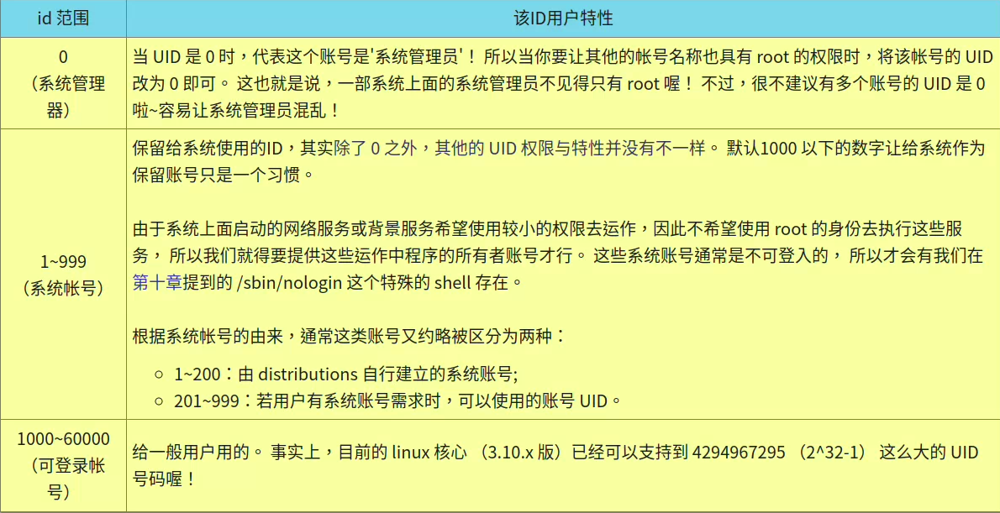

## 用户识别码： UID 与 GID
- UID：用户 ID （User ID，简称 UID）， /etc/passwd
- GID：群组 ID （Group ID，简称 GID），/etc/group
---
## 用户账号
- ### 账户登陆步骤
  - 1.先找寻 /etc/passwd 里面是否有账号？如果没有则跳出，如果有的则将该账号对应的 UID 与 GID （在 /etc/group 中）读出，另外，该帐号的家目录与 shell 设定也一并读出
  - 2.Linux 会进入 /etc/shadow 里面找出对应的帐号与 UID，然后核对一下密码是否相符
  - 3.密码相符则进入Shell的管控
- ### /etc/passwd 档案结构
```
root@yxj-computer:~# head -n 4 /etc/passwd
root:x:0:0:root:/root:/bin/bash
daemon:x:1:1:daemon:/usr/sbin:/usr/sbin/nologin
bin:x:2:2:bin:/bin:/usr/sbin/nologin
sys:x:3:3:sys:/dev:/usr/sbin/nologin
```
  - 1.帐号名：
  - 2.密码：
    - 放到/etc/shadow，显示为『 x 』
  - 3.UID：
    - 
  - 4.GID:
    - 规范群组名称与 GID 的对应
  - 5.用户信息说明栏：
    - 解释账号的意义，为finger指令提供信息
  - 6.主目录：
  - 7.Shell：
    - 使用哪个shell
    - /sbin/nologin可以让账号无法获得shell环境登录
- ### /etc/shadow 档案结构
```
root@yxj-computer:~# head -n 4 /etc/shadow
root:$y$j9T$lKzOcCQ9SfQW922V2eVwY0$p0Zj0ylozTKa6cYlHZQvsT5nfBnwh/3Nkctcvl6u683:19442:0:99999:7:::
daemon:*:19411:0:99999:7:::
bin:*:19411:0:99999:7:::
sys:*:19411:0:99999:7:::
```

  - #### 账号名称：
  - #### 密码：
     -  经过编码的密码 （ 加密）
     -  在此字段前加上 ！ 或 * 更改密码字段长度，就会让密码'暂时失效'了
  - #### 最近更动密码的日期：
     -  Linux日期的时间是以1970年1月1日作为1而累加的日期
  - #### 密码不可被更动的天数：
     -  密码最近一次被更改后需要经过几天才可以再被变更
        ```
        You must wait longer to change your password
        passwd: Authentication token manipulation error
        ```
  - #### 密码需要重新变更的天数：
     -  必须要在这个天数内重新设定密码，否则这个账号的密码将会'变为过期特性'
  - #### 密码需要变更期限前的警告天数:
    ```
    Warning: your password will expire in 5 days
    ```
  - #### 密码过期后的账号宽限时间（密码失效日）:
    - 如果密码过期了， 那当你登录系统时，系统会强制要求你必须要重新设定密码才能登录继续使用喔，这就是密码过期特性
        ```
        You are required to change your password immediately (password aged)
        WARNING: Your password has expired.
        You must change your password now and login again!
        Changing password for user dmtsai.
        Changing password for dmtsai
        (current) UNIX password:
        ```
  - #### 账号失效日期:
    - 这个账号在此字段规定的日期之后，将无法再使用
        ```
        Your account has expired; please contact your system administrator
        ```
  - #### 保留：
---
## 关于群组：有效与初始群组、groups， newgrp
- ### /etc/group 档案结构
    ```
    root@yxj-computer:~# head -n 4 /etc/group
    root:x:0:
    daemon:x:1:
    bin:x:2:
    sys:x:3:
    ```
  - #### 组名：
  - #### 群组密码：
    - 一般不需要设定，通常给“组群管理员”使用
    - 加密放在/etc/gshadow，字段显示『x』
  - #### GID：
    - 与 /etc/passwd 第四个字段使用的 GID 对应的群组名
  - #### 此群组支持的账号名称：
    - 加入此群组的账号
    - 账号填入此字段即可加入
- ### 有效组（effective group）与初始组（initial group）
  - 初始组：当用户一登入系统，立刻就拥有这个群组的相关权限
    - GID 就是所谓的'初始群组 (initial group) 
  - 有效组：用户此时此刻所在的群组是什么
- ### groups： 有效与支持群组的观察
```
yxj@yxj-computer:~$ groups
yxj adm cdrom sudo dip plugdev lpadmin lxd sambashare
```
  - 用户所支持的群组
  - 第一个输出的群组即为有效群组 （effective group）
- ### newgrp： 有效群组的切换
```
yxj@yxj-computer:/tmp$ touch test1
yxj@yxj-computer:/tmp$ newgrp adm
yxj@yxj-computer:/tmp$ touch test2
yxj@yxj-computer:/tmp$ ll test*
-rw-rw-r-- 1 yxj yxj 0  4月 21 10:44 test1
-rw-rw-r-- 1 yxj adm 0  4月 21 10:44 test2
yxj@yxj-computer:/tmp$ exit
```
  - 想切换的群组必须是已支持的群组
  - 指令可以变更目前用户的有效群组，**而且是另外以一个 shell 来提供这个功能**
  - 虽然用户的环境设置不会有影响，但是用户的'群组权限'将会重新被计算
  - 使用exit可回到原本的shell
  - 
- ### /etc/gshadow
```
root@yxj-computer:~# head -n 4 /etc/gshadow
root:*::
daemon:*::
bin:*::
sys:*::
```
  - 组名称
  - 密码栏，同样的，开头为 ！或 * 表示无合法密码，所以无群组管理员
  - 组管理器的账户
  - 有加入该群组支持的所属账号（与 /etc/group 内容相同）