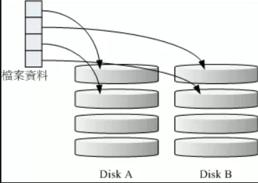
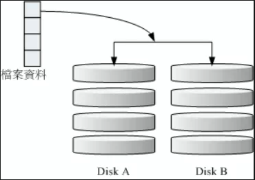
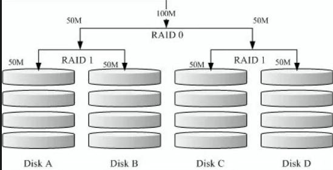

## RAID
### 定义
  - 磁盘阵列（Redundant Arrays of Independent Disks， RAID），独立容错磁盘列阵，通过技术（硬件或软件），将多个磁盘整合成较大的，具有数据保护功能的存储磁盘设备
### 常见类型
- #### RAID-0 （等量模式， stripe）：性能最佳
  - 将磁盘先切出等量的区块（名为chunk，一般可设定4K~1M之间），当文件写入时，会依据chunk大小切割好，再依次存放到各个磁盘
  - 使用相同型号与容量的磁盘来组成时，效果较佳
  - #### 特点：
    - 由于每个磁盘会交错的存放资料，因此数据要写入 RAID 时，数据会被等量的放置在各个磁盘上
    - 越多颗磁盘组成的 RAID-0 效能会越好，每颗负责的数据量更低
    - RAID-0只要有任何一颗磁盘损毁，在RAID上面的所有资料都会遗失而无法读取
  
  - 
- #### RAID-1 （映射模式， mirror）：完整备份
  - 让同一份资料，完整的保存在两颗磁盘上，所以整体RAID的容量几乎少了50%
  - RAID-1 最大的优点大概就在于资料的备份
  - 
- #### RAID 1+0：两者兼顾
  - 先让两颗磁盘组成 RAID 1，并且这样的设定共有两组
  - 这两组 RAID 1 再组成一组 RAID 0
  - 
- #### RAID 5：效能与数据备份的均衡考量
  -  至少需要三颗以上的磁盘
  -  每个循环的写入过程中（striping），每颗磁盘加入一个同位检查数据（Parity），记录其他磁盘的备份资料， 用于磁盘损毁时的救援
  -  RAID 5的总容量会是整体磁盘数量减一颗
  -  当损毁的磁盘数量大于等于两颗时，这整组 RAID 5 的数据就损毁了
- #### RAID 6
  - 与RAID 5类似，至少要四个以上的磁盘
  - 使用两颗磁盘的容量作为 parity 的存储
  - 允许出错的磁盘数量就可以达到两颗
- #### Spare Disk：预备磁盘
  - 一颗或多颗没有包含在原本磁盘阵列等级中的磁盘，替换损坏的磁盘，然后立即重建资料系统
### 磁盘阵列的优点
1. 数据安全与可靠性：磁盘损坏时，能安全救援
2. 读写性能：例如 RAID 0 可以加强读写效能，让你的系统 I/O 部分得以改善
3. 容量：可以让多颗磁盘组合起来

---
## hardware RAID 与 software RAID
- ### hardware RAID：硬件磁盘阵列
  - 使用磁盘阵列卡来达成阵列的目的
  - 磁盘阵列卡上面有一块专门的芯片在处理RAID的任务
  - 因此在效能方面会比较好，不会重复消耗原本系统的I/O总线
- ### software RAID：软件磁盘阵列
  - 使用软件来模拟阵列的任务
  - 因此会损耗较多的系统资源，CPU 的运算与 I/O 总线的资源等
  - 使用mdadm软件，以partition 或 disk 为磁盘的单位
  - 使用的设备文件名是系统的设备文件，文件名为 /dev/md0， /dev/md1...
---
## 软件磁盘阵列的设定
```
[root@study ~]# mdadm --detail /dev/md0
[root@study ~]# mdadm --create /dev/md[0-9] --auto=yes --level=[015] --chunk=NK \
> --raid-devices=N --spare-devices=N /dev/sdx /dev/hdx...
选项与参数：
--create          ：为创建 RAID 的选项；
--auto=yes        ：决定创建后面接的软件磁盘阵列设备，亦即 /dev/md0, /dev/md1...
--chunk=Nk        ：决定这个设备的 chunk 大小，也可以当成 stripe 大小，一般是 64K 或 512K。
--raid-devices=N  ：使用几个磁盘 （partition） 作为磁盘阵列的设备
--spare-devices=N ：使用几个磁盘作为备用 （spare） 设备
--level=[015]     ：设置这组磁盘阵列的等级。支持很多，不过建议只要用 0, 1, 5 即可
--detail          ：后面所接的那个磁盘阵列设备的详细信息
```
- 创建RAID 5 磁盘列阵，4个1G的partition，1个spare disk，chunk 设定为 256K 
```
#创建了5个分区，过程省略
root@yxj-computer:~# gdisk -l /dev/nvme0n1  
├─nvme0n1p13 259:13   0     1G  0 part  
├─nvme0n1p14 259:14   0     1G  0 part  
├─nvme0n1p15 259:15   0     1G  0 part  
├─nvme0n1p16 259:16   0     1G  0 part  
└─nvme0n1p17 259:17   0     1G  0 part  

#创建磁盘列阵
root@yxj-computer:~# mdadm --create /dev/md0 --auto=yes --level=5 --chunk=256 --raid-devices=4 --spare-devices=1 /dev/nvme0n1p{13,14,15,16,17}
mdadm: /dev/nvme0n1p13 appears to contain an ext2fs file system
       size=2097152K  mtime=Sat May 20 09:28:16 2023
Continue creating array? y
mdadm: Defaulting to version 1.2 metadata
mdadm: array /dev/md0 started.
root@yxj-computer:~# mdadm --detail /dev/md0
/dev/md0:                                                 # RAID 的设备文件名
           Version : 1.2
     Creation Time : Sat May 20 15:14:44 2023             # 创建 RAID 的时间
        Raid Level : raid5                                # RAID5 等级
        Array Size : 3139584 (2.99 GiB 3.21 GB)           # 整组 RAID 的可用容量
     Used Dev Size : 1046528 (1022.00 MiB 1071.64 MB)     # 每颗磁盘（设备）的容量
      Raid Devices : 4                                    # 组成 RAID 的磁盘数量
     Total Devices : 5                                    # 包括 spare 的总磁盘数
       Persistence : Superblock is persistent

       Update Time : Sat May 20 15:14:51 2023
             State : clean                                # 目前这个磁盘阵列的使用状态
    Active Devices : 4                                    # 启动（active）的设备数量
   Working Devices : 5                                    # 目前使用于此阵列的设备数
    Failed Devices : 0                                    # 损坏的设备数
     Spare Devices : 1                                    # 预备磁盘的数量

            Layout : left-symmetric
        Chunk Size : 256K                                 # chunk大小

Consistency Policy : resync

              Name : yxj-computer:0  (local to host yxj-computer)
              UUID : cbffcfb5:35757565:9e58218d:53256093
            Events : 18

    Number   Major   Minor   RaidDevice State             #五个设备目前的情况
       0     259       13        0      active sync   /dev/nvme0n1p13
       1     259       14        1      active sync   /dev/nvme0n1p14
       2     259       15        2      active sync   /dev/nvme0n1p15
       5     259       16        3      active sync   /dev/nvme0n1p16

       4     259       17        -      spare   /dev/nvme0n1p17

```
- 查看系统软件磁盘阵列的情况
```
root@yxj-computer:~# cat /proc/mdstat
Personalities : [raid6] [raid5] [raid4] 
#S为spare
md0 : active raid5 nvme0n1p16[5] nvme0n1p17[4](S) nvme0n1p15[2] nvme0n1p14[1] nvme0n1p13[0]   
      3139584 blocks super 1.2 level 5, 256k chunk, algorithm 2 [4/4] [UUUU]  
      #U为运行正常
```
- 格式化与挂载
```
#格式化
root@yxj-computer:~# mkfs.ext4 /dev/md0
#挂载
root@yxj-computer:~# mkdir /srv/raid
root@yxj-computer:~# mount /dev/md0 /srv/raid
root@yxj-computer:~# df /srv/raid
文件系统        1K的块  已用    可用 已用% 挂载点
/dev/md0       3015560    24 2842176    1% /srv/raid
```
---
## RAID 错误的救援模式
```
[root@study ~]# mdadm --manage /dev/md[0-9] [--add 设备] [--remove 设备] [--fail 设备] 
选项与参数：
--add    ：会将后面的设备加入到这个 md 中！
--remove ：会将后面的设备由这个 md 中移除
--fail   ：会将后面的设备设置成为出错的状态
```
- 模拟磁盘错误
```
#复制数据，假设RAID在使用
root@yxj-computer:~# cp -a /etc /srv/raid

# 1）设置 /dev/nvme0n1p13 设备出错
root@yxj-computer:~# mdadm --manage /dev/md0 --fail /dev/nvme0n1p13
mdadm: set /dev/nvme0n1p13 faulty in /dev/md0     #设置成功

# 2）spare disk 重建RAID 5
mdadm --detail /dev/md0
/dev/md0:
......省略......
       Update Time : Sat May 20 16:01:13 2023
             State : clean 
    Active Devices : 4
   Working Devices : 4
    Failed Devices : 1        # 磁盘损坏了一个
     Spare Devices : 0        # 预备磁盘替代损坏磁盘，变为0
......省略......
    Number   Major   Minor   RaidDevice State
       4     259       17        0      active sync   /dev/nvme0n1p17
       1     259       14        1      active sync   /dev/nvme0n1p14
       2     259       15        2      active sync   /dev/nvme0n1p15
       5     259       16        3      active sync   /dev/nvme0n1p16

       0     259       13        -      faulty   /dev/nvme0n1p13
```
- 将损坏磁盘移除并加入新磁盘
```
# 3）移除“损坏”磁盘 /dev/nvme0n1p13
root@yxj-computer:~# mdadm --manage /dev/md0 --remove /dev/nvme0n1p13
mdadm: hot removed /dev/nvme0n1p13 from /dev/md0

# 4）安装“新的”/dev/nvme0n1p13 磁盘
root@yxj-computer:~# mdadm --manage /dev/md0 --remove /dev/nvme0n1p13
mdadm: hot removed /dev/nvme0n1p13 from /dev/md0
......省略......
    Number   Major   Minor   RaidDevice State
       4     259       17        0      active sync   /dev/nvme0n1p17
       1     259       14        1      active sync   /dev/nvme0n1p14
       2     259       15        2      active sync   /dev/nvme0n1p15
       5     259       16        3      active sync   /dev/nvme0n1p16

       6     259       13        -      spare   /dev/nvme0n1p13
```
---
## 开机自动启动 RAID 并自动挂载
- software RAID 的配置文件在 /etc/mdadm.conf
- 只要知道 /dev/md0 的 UUID 就能够设置文件
```
# 找到uuid
root@yxj-computer:~# mdadm --detail /dev/md0 | grep -i uuid
              UUID : cbffcfb5:35757565:9e58218d:53256093

# 设定mdadm.conf
root@yxj-computer:~# vim /etc/mdadm.conf
ARRYA /dev/md0 UUID=cbffcfb5:35757565:9e58218d:53256093

# 开始设置开机自动挂载并测试
root@yxj-computer:~# blkid /dev/md0
/dev/md0: UUID="46bfc192-e23b-4e85-b0a6-8904d02d4c59" BLOCK_SIZE="4096" TYPE="ext4"

root@yxj-computer:~# vim /etc/fstab
UUID=46bfc192-e23b-4e85-b0a6-8904d02d4c59 /srv/raid       ext4    defaults        0       0

root@yxj-computer:~# umount /dev/md0; mount -a
root@yxj-computer:~# df -Th /srv/raid
文件系统       类型  大小  已用  可用 已用% 挂载点
/dev/md0       ext4  2.9G   18M  2.7G    1% /srv/raid
```
---
## 关闭软件 RAID
```

# 1）卸载并删除 /etc/fatab中的相关内容
root@yxj-computer:~# umount /srv/raid
root@yxj-computer:~# vim /etc/fstab
UUID=46bfc192-e23b-4e85-b0a6-8904d02d4c59 /srv/raid     ext4    defaults      0       0   # 删掉
```
