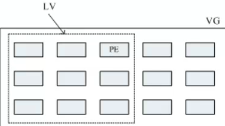
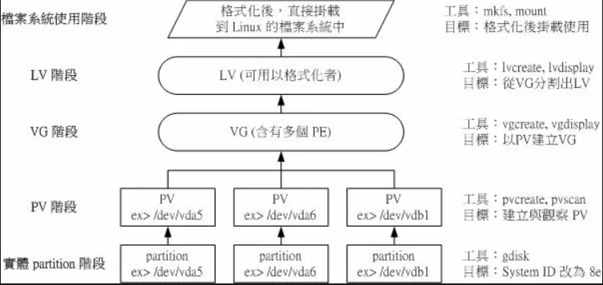
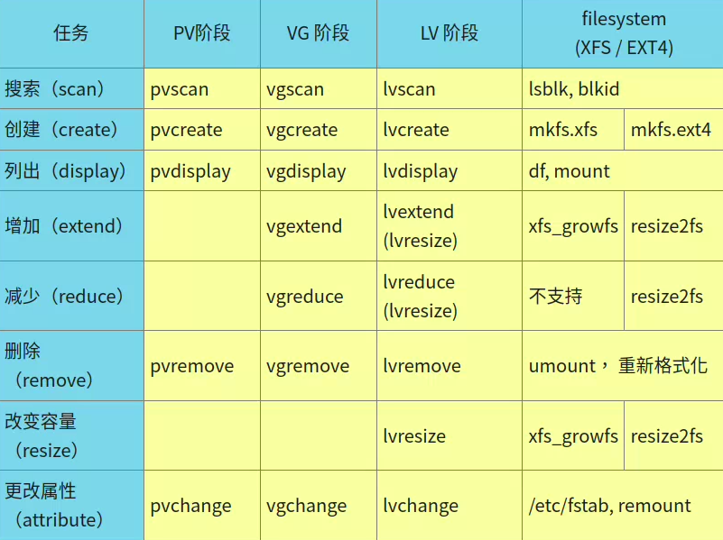
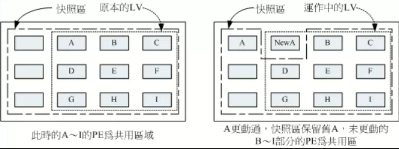

# 什么是逻辑卷管理（LVM）
### 概念
- Logical Volume Manage，LVM 可以整合多个实体 partition，使其看起来像一个磁盘，并且还能新增或移除其他partition
- 重点在于：可以弹性的调整 filesystem 容量
### PV，PE，VG，LV
- #### PV（Physical Volume）：物理卷
  - 将实际的磁盘分区（partition）系统识别码（system ID）修改为8e后，在通过pvcreate指令转化为LVM最底层的物理卷，作为后续空间管理的基础，用于记载与LVM相关的管理参数
- #### VG（Volume Group）：卷组
  - 将数个PV进行整合，从而形成VG
- #### PE（Physical Extent）：物理区块
  - LVM中最小的存储区块，类似文件系统的block
  - 默认4M，32位机最多有65534个PE=256G，64位无限制
- #### LV（Logical Volume）：逻辑卷
  - 由VG划分而成，最后被格式化使用，类似分区的逻辑卷
  - 大小由PE的大小及数量有关，Size（LV）= Count（PE）* Size（PE）
- 
### 写入模式
- #### 线性模式 （linear）
  - 一个设备容量用完之后，才会用后一个设备（默认使用该模式）
- #### 交错模式 （triped）
  - 类似RAID 0，一份数据被分散写到各个LVM成员
### 优缺点
  - #### 优点
    - 可以在系统运行的状态下动态的扩展文件系统的大小
    - 文件系统跨越多个磁盘，文件系统的大小不受磁盘大小的限制
    - LVM的存储空间可以通过新增磁盘的方式扩容
  - #### 缺点
    - 从卷组中移除一个磁盘的时候必须使用reducevg命令
    - 当卷组中有一个磁盘损坏了，整个卷组都会受到影响（由于一份数据可能会存储在不同的磁盘中）
    - 在磁盘创建过程中增加了额外的步骤，所以数据存贮性能会受到影响
---
## 创建流程

### 0. Disk阶段
   - 使用gdisk创建LVM分区，或用gdisk中的t，修改分区的SYSTEM ID为8e
### 1. PV阶段
```
pvcreate ：将实体 partition 建立成为 PV ;
pvscan ：搜索当前系统里面任何具有 PV 的磁盘;
pvdisplay ：显示出目前系统上面的 PV 状态;
pvremove：将PV属性移除，让该 partition 不具有 PV 属性。
```
```sh
# 1）创建PV
root@yxj-computer:~# pvcreate /dev/nvme0n1p{13,14,15,16}
  Physical volume "/dev/nvme0n1p13" successfully created.
  Physical volume "/dev/nvme0n1p14" successfully created.
  Physical volume "/dev/nvme0n1p15" successfully created.
  Physical volume "/dev/nvme0n1p16" successfully created.

root@yxj-computer:~# pvscan
  PV /dev/nvme0n1p13                      lvm2 [1.00 GiB]
  PV /dev/nvme0n1p14                      lvm2 [1.00 GiB]
  PV /dev/nvme0n1p15                      lvm2 [1.00 GiB]
  PV /dev/nvme0n1p16                      lvm2 [1.00 GiB]
  Total: 4 [4.00 GiB] / in use: 0 [0   ] / in no VG: 4 [4.00 GiB]
```
```
# 2）列出PV详细信息
root@yxj-computer:~# pvdisplay /dev/nvme0n1p13
  "/dev/nvme0n1p13" is a new physical volume of "1.00 GiB"
  --- NEW Physical volume ---
  PV Name               /dev/nvme0n1p13     <== 实际的 partition 设备名称
  VG Name                                   <== 尚未分配，所以空白
  PV Size               1.00 GiB
  Allocatable           NO                  <== 是否已被分配
  PE Size               0                   <== 在此 PV 内的 PE 大小
  Total PE              0                   <== 共分区出几个 PE
  Free PE               0                   <== 没被 LV 用掉的 PE
  Allocated PE          0                   <== 尚可分配出去的 PE 数量
  PV UUID               gsBqt1-dCnR-0m2Q-7EWd-Ec0s-Zc9J-Gx4Ofa
# PE 是在创建 VG 时才给予的参数，所以目前PE为0
```
### 2. VG阶段
```
vgcreate ：建立 VG 
  [root@study ~]# vgcreate [-s N[mgt]] VG名称 PV名称
  选项与参数：
  -s ：后面接 PE 的大小 （size） ，单位可以是 m, g, t （大小写均可）

vgscan ：搜索系统上面是否有 VG 存在
vgdisplay ：显示目前系统上面的 VG 状态;
vgextend ：在 VG 内增加额外的 PV ;
vgreduce ：在 VG 内移除 PV;
vgchange ：设定 VG 是否启动 （active）;
vgremove ：删除VG
```
```
# 1）将 /dev/nvme0n1p13-15 创建成为一个 VG，且指定 PE 为 16MB 
root@yxj-computer:~# vgcreate -s 16M testVG /dev/nvme0n1p{13,14,15}
  Volume group "testVG" successfully created
root@yxj-computer:~# vgscan
  Found volume group "testVG" using metadata type lvm2

root@yxj-computer:~# vgdisplay
  --- Volume group ---
  VG Name               testVG
  System ID             
  Format                lvm2
  Metadata Areas        3
  Metadata Sequence No  1
  VG Access             read/write
  VG Status             resizable
  MAX LV                0
  Cur LV                0
  Open LV               0
  Max PV                0
  Cur PV                3
  Act PV                3
  VG Size               2.95 GiB
  PE Size               16.00 MiB
  Total PE              189         
  Alloc PE / Size       0 / 0   
  Free  PE / Size       189 / 2.95 GiB
  VG UUID               RLz3Sh-icVT-2iP1-vW1T-DoOb-ebVZ-W1SWdV
```
```
# 2）添加新PV
root@yxj-computer:~# vgextend testVG /dev/nvme0n1p16 
  Volume group "testVG" successfully extended

root@yxj-computer:~# vgdisplay
......省略......
  VG Size               <3.94 GiB
  PE Size               16.00 MiB
  Total PE              252
  Alloc PE / Size       0 / 0   
  Free  PE / Size       252 / <3.94 GiB
```
### 3. LV阶段
```
lvcreate ：建立 LV 
  [root@study ~]# lvcreate [-L N[mgt]] [-n LV名称] VG名称
  [root@study ~]# lvcreate [-l N] [-n LV名称] VG名称
  选项与参数：
  -L  ：后面接容量，容量的单位可以是 M,G,T 等，要注意的是，最小单位为 PE，
        因此这个数量必须要是 PE 的倍数，若不相符，系统会自行计算最相近的容量。
  -l  ：后面可以接 PE 的“个数”，而不是数量。若要这么做，得要自行计算 PE 数
  -n  ：后面接的就是 LV 的名称

lvscan ：查询系统上的 LV 
lvdisplay ：显示系统上面的 LV 状态
lvextend ：在 LV 里面增加容量
lvreduce ：在 LV 里面减少容量
lvremove ：删除一个 LV 
lvresize ：对 LV 进行容量大小的调整
```
```
# 从VG划分LV
root@yxj-computer:~# lvcreate -L 2G -n testLV testVG
  Logical volume "testLV" created.
root@yxj-computer:~# lvscan
  ACTIVE            '/dev/testVG/testLV' [2.00 GiB] inherit

root@yxj-computer:~# lvdisplay /dev/testVG/testLV
  --- Logical volume ---
  LV Path                /dev/testVG/testLV
  LV Name                testLV
  VG Name                testVG
  LV UUID                rPmUxu-dMqi-Iy9j-hjSs-nqaU-4lc6-IjNDWF
  LV Write Access        read/write
  LV Creation host, time yxj-computer, 2023-05-21 13:54:31 +0800
  LV Status              available
  # open                 0
  LV Size                2.00 GiB
  Current LE             128
  Segments               3
  Allocation             inherit
  Read ahead sectors     auto
  - currently set to     256
  Block device           253:0
```
- 使用LV必须用全名，即/dev/testVG/testLV
### .4 格式化逻辑卷（LV）并挂载
```
# 格式化
root@yxj-computer:~# mkfs.ext4 /dev/testVG/testLV
mke2fs 1.46.5 (30-Dec-2021)
丢弃设备块： 完成                            
创建含有 524288 个块（每块 4k）和 131072 个 inode 的文件系统
文件系统 UUID：1ab0cb40-ee66-46a3-80ea-8c2073e7de79
超级块的备份存储于下列块： 
	32768, 98304, 163840, 229376, 294912
正在分配组表： 完成                            
正在写入 inode表： 完成                            
创建日志（16384 个块）： 完成
写入超级块和文件系统账户统计信息： 已完成

# 挂载
root@yxj-computer:~# mkdir /srv/lvm
root@yxj-computer:~# mount /dev/testVG/testLV /srv/lvm
root@yxj-computer:~# df -Th /srv/lvm
文件系统                  类型  大小  已用  可用 已用% 挂载点
/dev/mapper/testVG-testLV ext4  2.0G   24K  1.8G    1% /srv/lvm
root@yxj-computer:~# cp -a /etc /srv/lvm
root@yxj-computer:~# df -Th /srv/lvm
文件系统                  类型  大小  已用  可用 已用% 挂载点
/dev/mapper/testVG-testLV ext4  2.0G   18M  1.8G    1% /srv/lvm
```
---
## LV扩容
1. 确认VG是否还有剩余容量
   - 扩容LVM就是扩容LV，若VG没有剩余容量，LV也无法扩容
   - 可利用pvcreate 及 vgextend 扩充VG
2. 扩容LV
   - 利用 lvresize 扩充LV
3. 文件系统扩充
   - 实际使用的不是LV，而是LV设备内格式化后的文件系统（如ext4，xfs）
- 
``` 
# 1.查看VG容量，还有976MB剩余
root@yxj-computer:~# vgdisplay testVG
  --- Volume group ---
  VG Name               testVG
  System ID             
  Format                lvm2
  Metadata Areas        3
  Metadata Sequence No  2
  VG Access             read/write
  VG Status             resizable
  MAX LV                0
  Cur LV                1
  Open LV               1
  Max PV                0
  Cur PV                3
  Act PV                3
  VG Size               2.95 GiB
  PE Size               16.00 MiB
  Total PE              189
  Alloc PE / Size       128 / 2.00 GiB
  Free  PE / Size       61 / 976.00 MiB
  VG UUID               40uQbM-hfb7-O6lh-M7vE-kgv2-L4rQ-4HiZ2c

# 2.放大LV 500MB
root@yxj-computer:~# lvextend -L +500M /dev/testVG/testLV
  Rounding size to boundary between physical extents: 512.00 MiB.
  Size of logical volume testVG/testLV changed from 2.00 GiB (128 extents) to 2.50 GiB (160 extents).
  Logical volume testVG/testLV successfully resized.

root@yxj-computer:~# lvextend -L +500M /dev/testVG/testLV
  Rounding size to boundary between physical extents: 512.00 MiB.
  Size of logical volume testVG/testLV changed from 2.00 GiB (128 extents) to 2.50 GiB (160 extents).
  Logical volume testVG/testLV successfully resized.
root@yxj-computer:~# lvscan
  ACTIVE            '/dev/testVG/testLV' [2.50 GiB] inherit


# 3.扩充文件系统（范例为ext4）
root@yxj-computer:~# resize2fs /dev/testVG/testLV 2560M
resize2fs 1.46.5 (30-Dec-2021)
/dev/testVG/testLV 上的文件系统已被挂载于 /srv/lvm；需要进行在线调整大小
old_desc_blocks = 1, new_desc_blocks = 1
/dev/testVG/testLV 上的文件系统大小已经调整为 655360 个块（每块 4k）。

root@yxj-computer:~# df -Th /srv/lvm
文件系统                    类型   大小    已用  可用    已用%  挂载点
/dev/mapper/testVG-testLV  ext4  2.4G   18M   2.3G    1%   /srv/lvm
```
---
## 使用LVM thin Volume：精简卷
### 概念
- 建立一个用多少容量才分配多少容量的**磁盘容量存储池（thin pool）**，再由tin pool创建“指定大小”的**精简卷（thin volume）**，开始为空每，用多少从thin pool分配多少，所以“指定大小”理论上无上限
### 创建过程
#### 1. 从 testVG 中划分出 1G 的 lvThinPool 的thin pool
```
root@yxj-computer:~# lvcreate -L 1G -T testVG/lvThinPool
  Thin pool volume with chunk size 64.00 KiB can address at most 15.81 TiB of data.
  Logical volume "lvThinPool" created.

  root@yxj-computer:~# lvs testVG
  LV         VG     Attr       LSize Pool Origin Data%  Meta%  Move Log Cpy%Sync Convert
  lvThinPool testVG twi-a-tz-- 1.00g             0.00   10.23                           
  testLV     testVG -wi-ao---- 2.50g 
```
#### 2. 由 lvThinPool 创建大小为 10G 精简卷 thinLV
```

root@yxj-computer:~# lvcreate -V 10G -T testVG/lvThinPool -n thinLV
  WARNING: Sum of all thin volume sizes (10.00 GiB) exceeds the size of thin pool testVG/lvThinPool and the size of whole volume group (<3.94 GiB).
  WARNING: You have not turned on protection against thin pools running out of space.
  WARNING: Set activation/thin_pool_autoextend_threshold below 100 to trigger automatic extension of thin pools before they get full.
  Logical volume "thinLV" created.

root@yxj-computer:~# lvs testVG
  LV         VG     Attr       LSize  Pool       Origin Data%  Meta%  Move Log Cpy%Sync Convert
  lvThinPool testVG twi-aotz--  1.00g                   0.00   10.25                           
  testLV     testVG -wi-ao----  2.50g                                                          
  thinLV     testVG Vwi-a-tz-- 10.00g lvThinPool        0.00
```
#### 3. 格式化并挂载
```
root@yxj-computer:~# mkfs.ext4 /dev/testVG/thinLV
mke2fs 1.46.5 (30-Dec-2021)
丢弃设备块： 完成                            
创建含有 2621440 个块（每块 4k）和 655360 个 inode 的文件系统
文件系统 UUID：ec267890-9e5e-420a-8f26-077696ce113c
超级块的备份存储于下列块： 
	32768, 98304, 163840, 229376, 294912, 819200, 884736, 1605632
正在分配组表： 完成                            
正在写入 inode表： 完成                            
创建日志（16384 个块）： 完成
写入超级块和文件系统账户统计信息： 已完成

root@yxj-computer:~# mkdir /srv/thin
root@yxj-computer:~# mount /dev/testVG/thinLV /srv/thin
root@yxj-computer:~# df -Th /srv/thin
文件系统                  类型  大小  已用  可用 已用% 挂载点
/dev/mapper/testVG-thinLV ext4  9.8G   24K  9.3G    1% /srv/thin
```
#### 4. 创建500M的文件测试容量的使用
```
root@yxj-computer:~# dd if=/dev/zero of=/srv/thin/test.img bs=1M count=500
记录了500+0 的读入
记录了500+0 的写出
524288000字节（524 MB，500 MiB）已复制，0.172706 s，3.0 GB/s
root@yxj-computer:~# lvs testVG
  LV         VG     Attr       LSize  Pool       Origin Data%  Meta%  Move Log Cpy%Sync Convert
  lvThinPool testVG twi-aotz--  1.00g                   22.36  10.69                           
  testLV     testVG -wi-ao----  2.50g                                                          
  thinLV     testVG Vwi-aotz-- 10.00g lvThinPool        2.24
```
- 已分配了22.36%，结果thinLV只看到用掉2.24%
### 总结
- thin pool非常好用，但管理上特别麻烦
- 如果突破thin pool容量，会引起数据损坏，必须十分注意！
---
## LV磁盘快照
### 概念
- 快照（snapshot）就是记录当时的系统信息，若有资料改变，则把改动前的原始数据搬移到快照区，未改变的区域由快照区与文件系统共享
- 快照区与被快照的LV必须在同一个VG上
- 
### 创建传统快照区
- #### 1. 查看VG剩余容量
  ```
  root@yxj-computer:~# vgdisplay testVG
  ......省略......
    Total PE              252
    Alloc PE / Size       226 / 3.53 GiB
    Free  PE / Size       26 / 416.00 MiB
  #还剩26个PE
  ```
- #### 2. 创建快照区
  ```
  # -s为快照区选项
  root@yxj-computer:~# lvcreate -s -l 26 -n testSnap /dev/testVG/testLV
    Logical volume "testSnap" created.

  root@yxj-computer:~# lvdisplay /dev/testVG/testSnap
    --- Logical volume ---
    LV Path                /dev/testVG/testSnap
    LV Name                testSnap
    VG Name                testVG
    LV UUID                EU8gna-KBKS-zlLx-mtOy-YNTr-ZW9V-Zbd0mV
    LV Write Access        read/write
    LV Creation host, time yxj-computer, 2023-05-21 18:29:55 +0800
    LV snapshot status     active destination for testLV
    LV Status              available
    # open                 0
    LV Size                2.50 GiB
    Current LE             160
    COW-table size         416.00 MiB
    COW-table LE           26
    Allocated to snapshot  0.01%
    Snapshot chunk size    4.00 KiB
    Segments               1
    Allocation             inherit
    Read ahead sectors     auto
    - currently set to     256
    Block device           253:8
  ```
- #### 挂载
  ```
  #挂载时使用mount -o ro
  root@yxj-computer:~# mount -o ro /dev/testVG/testSnap /srv/snapShot1
  root@yxj-computer:~# df -Th /srv/lvm /srv/snapShot1
  文件系统                    类型  大小  已用  可用 已用% 挂载点
  /dev/mapper/testVG-testLV   ext4  2.4G   18M  2.3G    1% /srv/lvm
  /dev/mapper/testVG-testSnap ext4  2.4G   18M  2.3G    1% /srv/snapShot1
  ```
### 利用快照区复原系统
- 复原的数据量不能够高于快照区所能负载的实际容量
```
# 进行内容变更
root@yxj-computer:~# cp -a /usr/share/doc /srv/lvm
root@yxj-computer:~# rm -rf /srv/lvm/log
root@yxj-computer:~# df -Th /srv/lvm /srv/snapShot1
文件系统                    类型  大小  已用  可用 已用% 挂载点
/dev/mapper/testVG-testLV   ext4  2.4G   96M  2.2G    5% /srv/lvm
/dev/mapper/testVG-testSnap ext4  2.4G   18M  2.3G    1% /srv/snapShot1

# 快照区被使用
root@yxj-computer:~# lvdisplay /dev/testVG/testSnap
......省略......
Allocated to snapshot  22.51%
......省略......
```