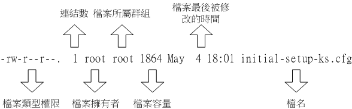
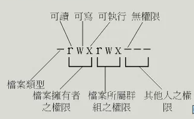

## Linux文件属性



1. 文件的类型于权限

    
   - 第一个字符表示文件为“目录、文件或链接等等”
     - [d] 目录文件
     - [-] 文件
     - [l] 链接文件
     - [b] 为设备文件里面的可存储的可随机存取设备
     - [c] 为设备文件里的序列埠设备，例如键盘、鼠标（一次性读取设备）
   - 其他字符，三个为一组，均为“rwx”三个参数组合，[r]可读(read),[w]可写(write)，[x]可执行(execute),[-]没有
     - 第一组为“文件拥有者可具备权限”
     - 第二组为“加入此群组的账号权限”
     - 第三组为“非本人且没有加入本群组的其他账号权限”（其他）
2. 文件链接到此的节点
   - i-node号码
3. 文件（目录）的“拥有者账号”
4. 文件所属群组
5. 文件容量大小（默认Bytes）
6. 文件的创建日期或最近修改日期
7. 文件名
---
## 改变文件属性与权限
- 改变群组：chgrp
  
    ``` 
    chgrp  [R]  option  dirname/filename
    选项与参数：
    -R：进行递归的持续变更，就是目录下的所有目录、文件全部更新
    ``` 
- 改变文件拥有者：chown
    ``` 
    chown  [-R]  帐号名称  文件或目录
    chown  [-R]  帐号名称:群组名称  文件或目录
    选项与参数：
    -R：进行递归的持续变更，就是目录下的所有目录、文件全部更新
    ``` 
- 改变权限：chmod
  - 数字类型改变文件权限
    - 用数字代表各个权限
      - \>r : 4 > w : 2 > x : 1
    - 每种身份(owner/group/others)各自的三个权限(r/w/x)需要累加
    - 如 [-rwxrw-r--] ：&nbsp; rwx+=4+2+1=7 &nbsp;&nbsp; rw-=4+2=6 &nbsp;&nbsp; r--=4 &nbsp;&nbsp; 权限为764
  - 符号类型改变文件权限
    ```
    | chmod | u g o a | +（加入） -（除去） =（设置） | r w x | 文件或目录 |
    ```
    - user=u &nbsp;&nbsp; group=g &nbsp;&nbsp; others=o &nbsp;&nbsp; a代表全部<p></p>
    ```
    -rwxrxrx表示为
    chmod  u=rwx,go=rx  .bashrc
    去除所有x的权限
    chmod  a-x  .bashrc
    ```
---
## 权限对目录与文件的意义
- 对文件的重要性
  - r（read）：可读取此一文件的实际内容
  - w（write）：可以编辑、新增或者是修改该文件的内容（但不含删除该文件）；
  - x（eXecute）：该文件具有可以被系统执行的权限。
- 对目录的重要性
  - r（read contents in directory）：表示具有读取目录结构清单的权限
  - w（modify contents of directory）
    - 创建新的文件与目录
    - 删除文件与目录（不论文件的权限为何！）
    - 文件与目录的更名
    - 迁移目录内的文件、目录位置
  - x（access directory）：使用着能否进入该目录成为工作目录（work directory）
---
## Linux文件种类与扩展名
- 文件种类
  - 正规文件（regular file）：第一个属性为[-]的文件
    - 纯文本文件（ASCII）
    - 二进制文件（binary）
    - 数据格式文件（data）
  - 目录（directory）第一个属性为[d]的文件
  - 链接文件（link）：第一个属性为[l],类似Windows的快捷方式
  - 设备与设备文件（device）与系统外部及存储相关的一些文件，通常都集中在/dev文件下，分为两种
    - 区块（blok）文件：第一个属性为[d],存储数据，提供系统随即存储的外部设备（硬盘软盘）
    - 字符（character）设备文件：第一个属性为[c]外设文件，特点是一次性读取，不能够间断
  - 数据接口文件（sockets）：第一个属性为[s],常在/run或/tmp文件中，通过socket进行数据沟通
  - 数据输送文档（FIFO，pipe）：第一个属性为[p]，解决多个程序同时存取一个文件造成的错误问题
- Linux文件扩展名
  一个Linux的文件能不能执行，与[ x ]属性有关系，与扩展名一点关系也没有（如EXE）
    - *.sh:脚本或批处理文件（scripts），全称为shell
    - Z，.tar，.tar.gz，.zip，*.tgz：压缩文件
- Linux文件长度限制
  - 但个文件或目录最大文件名为255Bytes，255字符,128中文
- Linux文件名限制
  - 避开 ? > < ; & ! [ ] | \ ' " ` （ ） { }