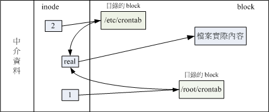
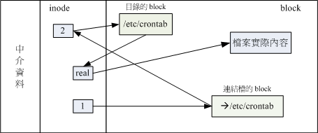

## 磁盘与目录的容量
- ### df:列出文件系统的整体磁盘使用量
    ```
    [[email protected] ~]# df [-ahikHTm] [目录或文件名]
    选项与参数：
    -a  ：列出所有的文件系统，包括系统特有的 /proc 等文件系统；
    -k  ：以 KBytes 的容量显示各文件系统；
    -m  ：以 MBytes 的容量显示各文件系统；
    -h  ：以人们较易阅读的 GBytes, MBytes, KBytes 等格式自行显示；
    -H  ：以 M=1000K 取代 M=1024K 的进位方式；
    -T  ：连同该 partition 的 filesystem 名称 （例如 xfs） 也列出；
    -i  ：不用磁盘容量，而以 inode 的数量来显示
    ```
    ```
    范例一：将系统内所有的 filesystem 列出来！
    [[email protected] ~]# df
    Filesystem              1K-blocks    Used Available Use% Mounted on
    /dev/mapper/centos-root  10475520 3409408   7066112  33% /
    devtmpfs                   627700       0    627700   0% /dev
    tmpfs                      637568      80    637488   1% /dev/shm
    tmpfs                      637568   24684    612884   4% /run
    tmpfs                      637568       0    637568   0% /sys/fs/cgroup
    /dev/mapper/centos-home   5232640   67720   5164920   2% /home
    /dev/vda2                 1038336  133704    904632  13% /boot
    ```
    - 如果 df 没有加任何选项，那么默认会将系统内所有的
    - Filesystem：代表该文件系统是在哪个 partition ，所以列出设备名称；
    - 1k-blocks：说明下面的数字单位是 1KB ,可利用 -h 或 -m 来改变容量；
    - Used：使用掉的磁盘空间
    - Available：剩下的磁盘空间大小；
    - Use%：磁盘的使用率
    - Mounted on：就是磁盘挂载的目录所在（挂载点）
- ### du：评估文件系统的磁盘使用量
    ```
    [[email protected] ~]# du [-ahskm] 文件或目录名称
    选项与参数：
    -a  ：列出所有的文件与目录容量，因为默认仅统计目录下面的文件量而已。
    -h  ：以人们较易读的容量格式 （G/M） 显示；
    -s  ：列出总量而已，而不列出每个各别的目录占用容量；
    -S  ：不包括子目录下的总计，与 -s 有点差别。
    -k  ：以 KBytes 列出容量显示；
    -m  ：以 MBytes 列出容量显示；
    ```
    - du默认会将次目录的容量也计算一次，最终容量也会加一次
    - 使用 -S 列出目录下的全部资料，可减少次目录的加总
---
## ln：实体链接与符号链接
```
[[email protected] ~]# ln [-sf] 来源文件 目标文件
选项与参数：
-s  ：如果不加任何参数就进行链接，那就是hard link，至于 -s 就是symbolic link
-f  ：如果 目标文件 存在时，就主动的将目标文件直接移除后再创建！
```
- ### Hard Link（物理链接，硬式链接或实际链接）
  - 多个文件名对应到同一个 inode 号码
    - 在某个目录下新增一笔文件名链接到某 inode 号码的关连记录 
    ```
    [[email protected] ~]# ln /etc/crontab .   &lt;==创建实体链接的指令
    [[email protected] ~]# ll -i /etc/crontab crontab
    34474855 -rw-r--r--. 2 root root 451 Jun 10  2014 crontab
    34474855 -rw-r--r--. 2 root root 451 Jun 10  2014 /etc/crontab
    ```
    - 
    - 如果将任何一个文件名删除，inode与block都在，可通过另一个文件读取、修改文件数据
    - 只是在某目录下的 block 多写入一个关连数据，既不会增加 inode 也不会耗用 block 数量
  - Hard Link限制
    - 不能跨 Filesystem；
    - 不能 link 目录。
      - 还要链接目录中的内容，太过复杂
- ### Symbolic Link（符号链接，快捷方式）
  - 创建一个独立的文件，让数据的读取指向 link 的那个文件的文件名
  - 所创建的为独立新文件，占用inode与block
    ```
    [[email protected] ~]# ln -s /etc/crontab crontab2
    [[email protected] ~]# ll -i /etc/crontab /root/crontab2
    34474855 -rw-r--r--. 2 root root 451 Jun 10  2014 /etc/crontab
    53745909 lrwxrwxrwx. 1 root root  12 Jun 23 22:31 /root/crontab2 --> /etc/crontab
    ```
  - 
- ### 目录的 link 数量
  - 当我们创建一个新的目录时， “新的目录的 link 数为 2 ，而上层目录的 link 数则会增加 1 
  - 当创建新目录名为 /tmp/testing，会有
    - /tmp/testing
    - /tmp/testing/.
    - /tmp/testing/..
  - /tmp/testing 与 /tmp/testing/. 代表该目录，/tmp/testing/.. 代表/tmp目录
  ```
  [[email protected] ~]# ls -ld /tmp
  drwxrwxrwt. 14 root root 4096 Jun 23 22:42 /tmp
  [[email protected] ~]# mkdir /tmp/testing1
  [[email protected] ~]# ls -ld /tmp
  drwxrwxrwt. 15 root root 4096 Jun 23 22:45 /tmp   # 这里的 link 数量加 1 了
  [[email protected] ~]# ls -ld /tmp/testing1
  drwxr-xr-x. 2 root root 6 Jun 23 22:45 /tmp/testing1/
  ```