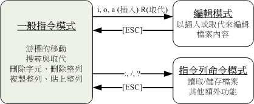
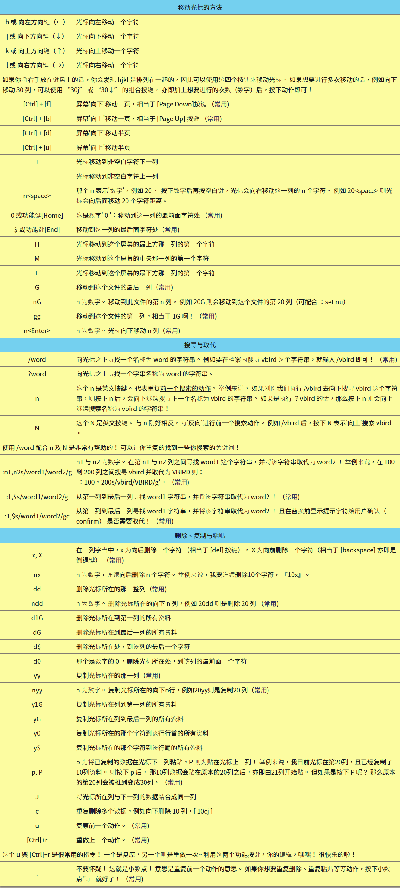
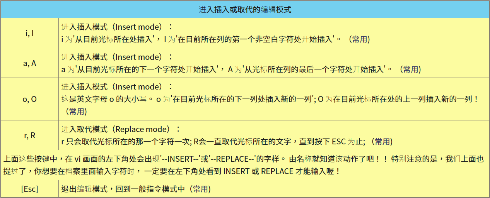
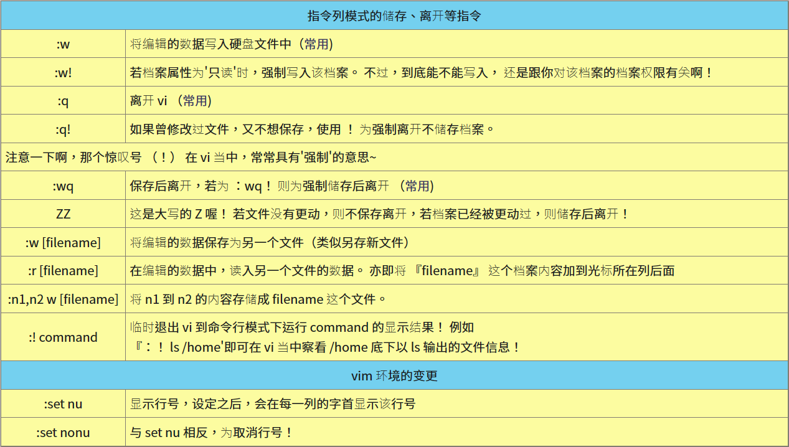
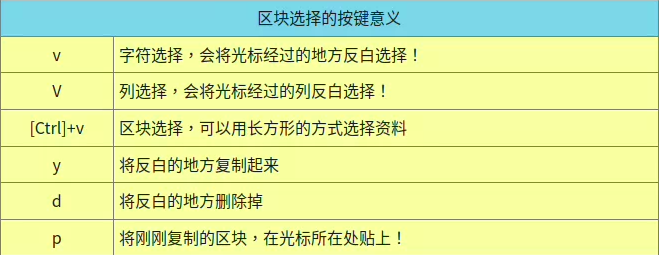
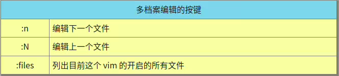
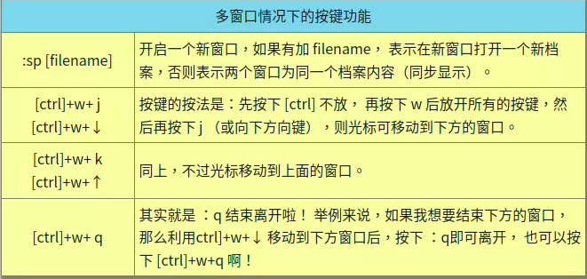
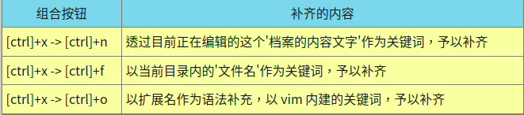
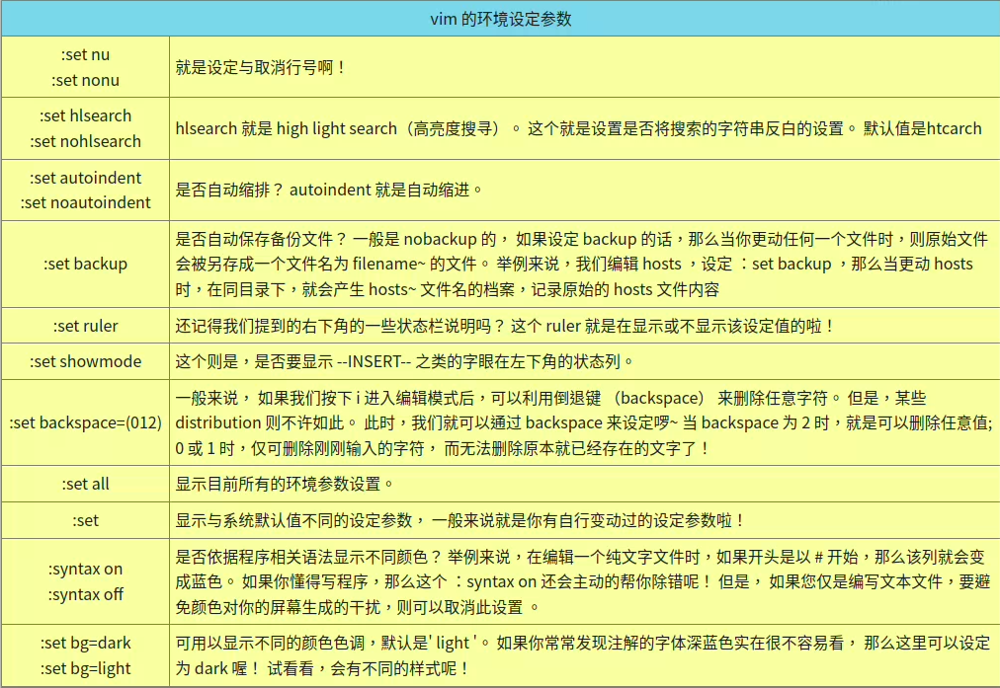

## vim的三种模式
- 命令模式（Command mode）
  - 可以使用“上下左右”按键来移动光标，使用“删除字符”或“删除整列”来处理文件内容， 使用“复制、贴上”来处理你的文件数据，但无法编辑文件内容
- 输入模式（Insert mode）
  - 按下“i, I, o, O, a, A, r, R”等任何一个字母之后才会进入输入模式
  - 在画面的左下方会出现“ INSERT 或 REPLACE ”的字样，才可以进行编辑
  - 要回到命令模式时， 按下“Esc”这个按键即可退出
- 末行命令模式（Last line mode）
  - 输入“ : / ? ”三个中的任何一个按钮，就可以将光标移动到最下面那一列
  - 可以提供你“搜寻数据”的动作，而读取、存盘、大量取代字符、离开 vi 、显示行号等等的动作
- 
---
## 按键说明
- ### 命令模式按键
  - 
- ### 输入模式按键
  - 
- ### 末行模式按键
  - 
---
## vim 的暂存档、救援回复与开启时的警告讯息
  -  vim 会在被编辑的文件的目录下，再建立一个名为 .filename.swp 的暂存档
  -  由于 vim 的工作被不正常的中断，导致暂存档无法借由正常流程来结束， 所以暂存文件就不会消失，而继续保留下来
    ```
    E325: 注意
    发现交换文件 ".yxj.conf.swp"
                所有者: yxj    日期: 2023-03-29 11:28:59
                文件名: /tmp/yxj.conf
                修改过: 否
                用户名: yxj      主机名: yxj-computer
              进程 ID: 5583 （还！在！运！行！）
    正在打开文件 "yxj.conf"
                  日期: 2023-03-29 11:27:53

    (1) 另一个程序可能也在编辑同一个文件。
        如果是这样，修改时请注意避免同一个文件产生两个不同的版本。
        退出，或者小心地继续。
    (2) 上次编辑此文件时崩溃。
        如果是这样，请用 ":recover" 或 "vim -r yxj.conf"
        恢复修改的内容 (请见 ":help recovery")。
        如果你已经进行了恢复，请删除交换文件 ".yxj.conf.swp"
        以避免再看到此消息。

    交换文件 ".yxj.conf.swp" 已存在！
    以只读方式打开([O]), 直接编辑((E)), 恢复((R)), 退出((Q)), 中止((A)): 
    ```
  - [O] pen Read-Only：打开此文件成为只读文件
  - （E）dit anyway：还是用正常的方式打开你要编辑的那个档案，并不会载入临时文件的内容。不过很容易出现两个用户互相改变对方的档案等问题
  - （R）ecover：就是加载暂存档的内容，用来救回之前未储存的工作。不过救回来并且储存离开 vim 后，还是要手动自行删除那个临时
  - （D）elete it：你确定那个暂存档是无用的，那么开启文件前会先将这个临时文件删除！比较常用
  - （Q）uit：按下 q 就离开 vim ，不会进行任何动作回到命令提示字符。
  - （A）bort：忽略这个编辑行为，与 quit 非常类似，也会送回到命令提示字符
---
## 区块选择（Visual Block）
- 按下 v 或者 V 或者 [Ctrl]+v 时，启动区块选择
- 
---
## 多文件编辑
- 
## 多窗口功能
- 
- 想要在新窗口启动另一个文件，就加入文件名
- 仅输入 :sp 时，出现的则是同一个文件在两个窗口间
## 代码补全功能
- 
## vim环境设定与记录：~/.vimrc,!/.viminfo
-  vim 会主动的将你曾经做过的行为登录下来,记录动作的文件是： ~/.viminfo 
- 
- 整体 vim 的设定值一般是放置在 /etc/vimrc 这个档案,不建议修改
  - 可以修改 ~/.vimrc （默认不存在，手动建立）
```
[[email protected] ~]$ vim ~/.vimrc
"这个文件的双引号 （"） 是注解
set hlsearch            "高亮度反白
set backspace=2         "可随时用倒退键删除
set autoindent          "自动缩排
set ruler               "可显示最后一列的状态
set showmode            "左下角那一列的状态
set nu                  "可以在每一列的最前面显示行号啦！
set bg=dark             "显示不同的底色色调
syntax on               "进行语法检验，颜色显示。
```