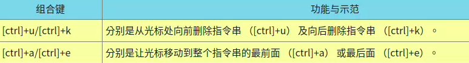

## Bash shell的功能
- ### 命令编修能力（history）
  - 记忆使用过的命令，使用“上下建”就能找到前/后一个输入的指令
  - 记录文件在~/.bash_history，为前一次登陆执行过的指令
- ### 命令与文件补全功能（tab键）
  - [Tab] 接在一串指令的第一个字的后面，则为命令补全；
  - [Tab] 接在一串指令的第二个字以后时，则为“文件补齐”！
  - 若安装 bash-completion 软件，则在某些指令后面使用 [tab] 按键时，可以进行“选项/参数的补齐”功能！
- ### 命令别名设置功能（alias）
    ```
    alias lm='ls -al'
    使用lm，相当于使用'ls -al'
    ```
- ### 程序化脚本（shell scripts）
  - 将平时管理系统常需要下达的连续指令写成一个文件， 该文件并且可以通过对谈互动式的方式来进行主机的侦测工作
  - 也可以借由 shell 提供的环境变量及相关指令来进行设计
- ### 万用字符（Wildcard）
  - 同windows一样，“*”  “？”等
## 查询指令是否为 Bash shell 的内置命令： type
```
[[email protected] ~]$ type [-tpa] name
选项与参数：
    ：不加任何选项与参数时，type 会显示出 name 是外部指令还是 bash 内置指令
-t  ：当加入 -t 参数时，type 会将 name 以下面这些字眼显示出他的意义：
      file    ：表示为外部指令；
      alias   ：表示该指令为命令别名所设置的名称；
      builtin ：表示该指令为 bash 内置的指令功能；
-p  ：如果后面接的 name 为外部指令时，才会显示完整文件名；
-a  ：会由 PATH 变量定义的路径中，将所有含 name 的指令都列出来，包含 alias
```
## 指令的下达与快速编辑按钮
- 指令太长用（\）+ 回车 在下一行输出
```
[dmtsai@study ~]$ cp /var/spool/mail/root /etc/crontab \
> /etc/fstab /root
```
- 