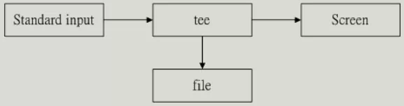

## 管线命令（pipe）
- 管线命令使用的是『 | 』 这个界定符号
- 管线命令仅会处理 standard output，对于 standard error output 会予以忽略
- 管线命令必须要能够接受来自前一个指令的数据成为 standard input 继续处理才行
  - 如 less， more， head， tail 等都是可以接受 standard input 的管线命令
  - ls， cp， mv 等就不是管线命令了
---
## 撷取命令： cut， grep
- ### cut
  - cut 主要的用途在于将“同一行里面的数据进行分解
    ```
    [dmtsai@study ~]$ cut -d'分隔字符' -f fields <==用于有特定分隔字符
    [dmtsai@study ~]$ cut -c 字符区间            <==用于排列整齐的讯息
    选项与参数：
    -d  ：后面接分隔字符。与 -f 一起使用；
    -f  ：依据 -d 的分隔字符将一段讯息分区成为数段，用 -f 取出第几段的意思；
    -c  ：以字符 （characters） 的单位取出固定字符区间；
    ```
    ```
    #范例：用 last 将显示的登陆者的信息中，仅留下第一栏使用者
    [dmtsai@study ~]$ last
    root   pts/1    192.168.201.101  Sat Feb  7 12:35   still logged in
    root   pts/1    192.168.201.101  Fri Feb  6 12:13 - 18:46  (06:33)
    root   pts/1    192.168.201.254  Thu Feb  5 22:37 - 23:53  (01:16)

    last | cut -d ' ' -f 1
    root
    root
    root
    ```
- ### grep
  - grep分析一行信息，若有所需信息，就提取出来
    ```
    [dmtsai@study ~]$ grep [-acinv] [--color=auto] '搜寻字串' filename
    选项与参数：
    -a ：将 binary 文件以 text 文件的方式搜寻数据
    -c ：计算找到 '搜寻字串' 的次数
    -i ：忽略大小写的不同，所以大小写视为相同
    -n ：顺便输出行号
    -v ：反向选择，亦即显示出没有 '搜寻字串' 内容的那一行
    --color=auto ：可以将找到的关键字部分加上颜色的显示
    ```
    ```
    #范例：在 last 中，只提取有 yxj 的一行
    yxj@yxj-computer:/tmp$ last | grep 'yxj'
    yxj      tty2         tty2             Sat Apr  8 07:57   still logged in
    yxj      tty2         tty2             Fri Apr  7 15:56 - down   (-4:22)
    yxj      tty2         tty2             Wed Apr  5 16:15 - down   (-6:31)
    ...以下省略...
    ```
---
## 排序命令： sort， wc， uniq
- ### sort
    ```
    [dmtsai@study ~]$ sort [-fbMnrtuk] [file or stdin]
    选项与参数：
    -f  ：忽略大小写的差异，例如 A 与 a 视为编码相同；
    -b  ：忽略最前面的空白字符部分；
    -M  ：以月份的名字来排序，例如 JAN, DEC 等等的排序方法；
    -n  ：使用“纯数字”进行排序（默认是以文字体态来排序的）；
    -r  ：反向排序；
    -u  ：就是 uniq ，相同的数据中，仅出现一行代表；
    -t  ：分隔符号，默认是用 [tab] 键来分隔；
    -k  ：以哪个区间 （field） 来进行排序的意思
    ```
    ```
    #范例：etc/passwd 内容是以 : 来分隔的，取第三栏排序
    yxj@yxj-computer:/tmp$ cat /etc/passwd | sort -t ':' -k 3
    root:x:0:0:root:/root:/bin/bash
    yxj:x:1000:1000:yxj,,,:/home/yxj:/bin/bash
    systemd-network:x:100:102:systemd Network Management,,,:/run/systemd:/usr/sbin/nologin
    ...以下省略...
    ```
- ### uniq：统计数据的重复个数
    ```
    [dmtsai@study ~]$ uniq [-ic]
    选项与参数：
    -i  ：忽略大小写字符的不同；
    -c  ：进行计数
    ```
    ```
    #范例：使用 last 将帐号列出，仅取出帐号栏，统计出现此书
    yxj@yxj-computer:/tmp$ last | cut -d ' ' -f1 | sort | uniq -c
     16 reboot
      1 wtmp
     17 yxj
    ```
- ### wc：统计行数，单词数，字数
    ```
    [dmtsai@study ~]$ wc [-lwm]
    选项与参数：
    -l  ：仅列出行；
    -w  ：仅列出多少字（英文单字）；
    -m  ：多少字符；
    ```
    ```
    #范例：
    yxj@yxj-computer:/tmp$ last | wc
     35     351    2447
     行数  单词数    字数
    ```
---
## 双向重导向： tee
- 
```
[dmtsai@study ~]$ tee [-a] file
选项与参数：
-a  ：以累加 （append） 的方式，将数据加入 file 当中
```
```
#范例：last输出到屏幕，同时保存到文件中
[dmtsai@study ~]$ last | tee last.list | cut -d " " -f1
```
## 字符转换命令： tr， col， join， paste， expand
- ### tr
    ```
    [dmtsai@study ~]$ tr [-ds] SET1 ...
    选项与参数：
    -d  ：删除讯息当中的 SET1 这个字串；
    -s  ：取代掉重复的字符！
    ```
    ```
    #范例：-s的使用
    yxj@yxj-computer:/tmp$ cat test1.txt
    qqqqqqqqq
    wwwwwwwww
    yxj@yxj-computer:/tmp$ cat test1.txt | tr -s 'q'
    q
    wwwwwwwww
    ```
- ### col
```
[dmtsai@study ~]$ col [-xb]
选项与参数：
-x  ：将 tab 键转换成对等的空白键
```
- ### join:处理两个文件中，相同数据
  - 在使用 join 之前，需要处理的档案应该要事先经过排序 （sort） 处理
    ```
    [dmtsai@study ~]$ join [-ti12] file1 file2
    选项与参数：
    -t  ：join 默认以空白字符分隔数据，并且比对“第一个字段”的数据，
        如果两个文件相同，则将两笔数据联成一行，且第一个字段放在第一个！
    -i  ：忽略大小写的差异；
    -1  ：这个是数字的 1 ，代表“第一个文件要用那个字段来分析”的意思；
    -2  ：代表“第二个文件要用那个字段来分析”的意思。
    ```
    ```
    #范例：etc/passwd 第四个字段是 GID，/etc/group的第十个字段是 GID,整合到一起
    [root@study ~]# join -t ':' -1 4 /etc/passwd -2 3 /etc/group | head -n 3
    0:root:x:0:root:/root:/bin/bash:            root:x:
    1:bin:x:1:bin:/bin:/sbin/nologin:           bin:x:
    2:daemon:x:2:daemon:/sbin:/sbin/nologin:    daemon:x:
    #为了示范，故意共tab隔开
    ```
- ### paste：将两个文件中相关的两行粘在一起，且以 [tab] 隔开
  - 
    ```
    [dmtsai@study ~]$ paste [-d] file1 file2
    选项与参数：
    -d  ：后面可以接分隔字符。默认是以 [tab] 来分隔的！
    -   ：如果 file 部分写成 - ，表示来自 standard input 的数据的意思。
    ```
    ```
    #范例：
    root@yxj-computer:~# paste /etc/passwd /etc/shadow
    bin:x:2:2:bin:/bin:/usr/sbin/nologin	bin:*:19411:0:99999:7:::
    sys:x:3:3:sys:/dev:/usr/sbin/nologin	sys:*:19411:0:99999:7:::
    sync:x:4:65534:sync:/bin:/bin/sync	sync:*:19411:0:99999:7:::
    ```
    ```
    范例二：带 - 号的使用
    cat /etc/group|paste /etc/passwd /etc/shadow -|head -n 3
    ```
- ### expand： [tab] 按键转成空白键
    ```
    [dmtsai@study ~]$ expand [-t] file
    选项与参数：
    -t  ：后面可以接数字。一般来说，一个 tab 按键可以用 8 个空白键取代。
    ```
## 分区命令： split
```
[dmtsai@study ~]$ split [-bl] file PREFIX
选项与参数：
-b  ：后面可接欲分区成的文件大小，可加单位，例如 b, k, m 等；
-l  ：以行数来进行分区。
PREFIX ：代表前置字符的意思，可作为分区文件的前导文字。
```
```
范例：etc/services 有600K，分成 300K 的多个文件？
[dmtsai@study ~]$ cd /tmp; split -b 300k /etc/services services
[dmtsai@study tmp]$ ll -k services*
-rw-rw-r--. 1 dmtsai dmtsai 307200 Jul  9 22:52 servicesaa
-rw-rw-r--. 1 dmtsai dmtsai 307200 Jul  9 22:52 servicesab
-rw-rw-r--. 1 dmtsai dmtsai  55893 Jul  9 22:52 servicesac
```
## 参数代换： xargs
```
[dmtsai@study ~]$ xargs [-0epn] command
选项与参数：
-0  ：如果输入的 stdin 含有特殊字符，例如 `, \, 空白键等等字符时，这个 -0 参数
      可以将他还原成一般字符
-e  ：EOF （end of file） 的意思。后面可以接一个字串，当 xargs 分析到这个字串时，
      就会停止继续工作！
-p  ：在执行每个指令的 argument 时，都会询问使用者的意思；
-n  ：后面接次数，每次 command 指令执行时，要使用几个参数的意思
当 xargs 后面没有接任何的指令时，默认是以 echo 来进行输出喔
```
```
#范例：显示每个账号的内容，通过 -n 来处理，一次给予一个参数
yxj@yxj-computer:/tmp$ cut -d ':' -f 1 /etc/passwd |head -n 3 | xargs -n 1 id
uid=0(root) gid=0(root) 组=0(root)
uid=1(daemon) gid=1(daemon) 组=1(daemon)
uid=2(bin) gid=2(bin) 组=2(bin)
```
```
范例：找出 /usr/sbin 下面具有特殊权限的文件名，并使用 ls -l 列出详细属性
yxj@yxj-computer:/tmp$ find /usr/sbin -perm /7000 | xargs ls -l
-rwxr-sr-x 1 root shadow  22680  2月  2 17:21 /usr/sbin/pam_extrausers_chkpwd
-rwsr-xr-- 1 root dip    424512  2月 25  2022 /usr/sbin/pppd
-rwxr-sr-x 1 root shadow  26776  2月  2 17:21 /usr/sbin/unix_chkpwd
```
## 减号 - 的用途
- 常用在：前一个指令的 stdout 作为这次的 stdin
```
[root@study ~]# mkdir /tmp/homeback
[root@study ~]# tar -cvf - /home | tar -xvf - -C /tmp/homeback
```
- 我将 /home 里面的档案给他打包，但打包的数据不是纪录到档案，而是传送到 stdout;
- 经过管线后，将 tar -cvf - /home 传送给后面的 tar -xvf -