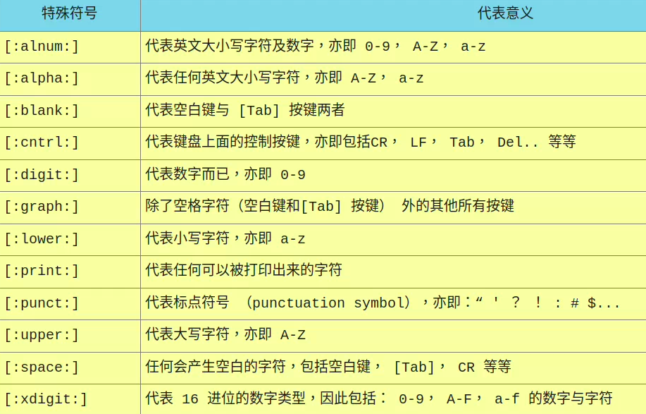

## 语系对正则表达式的影响
- LANG=C 时：0 1 2 3 4 ... A B C D ... Z a b c d ... z
- LANG=zh_TW 时：0 1 2 3 4 ... a A b B c C d D ... z Z
  - 使用[A-Z]时，会是：A a B b...
---
## 基础正则表达式
- 
- 
---
## sed 工具
```
[dmtsai@study ~]$ sed [-nefr] [动作]
选项与参数：
-n  ：使用安静（silent）模式。在一般 sed 的用法中，所有来自 STDIN 的数据一般都会被列出到屏幕上。
      但如果加上 -n 参数后，则只有经过 sed 特殊处理的那一行（或者动作）才会被列出来。
-e  ：直接在命令行界面上进行 sed 的动作编辑；
-f  ：直接将 sed 的动作写在一个文件内， -f filename 则可以执行 filename 内的 sed 动作；
-r  ：sed 的动作支持的是延伸型正则表达式的语法。（默认是基础正则表达式语法）
-i  ：直接修改读取的文件内容，而不是由屏幕输出。

动作说明：  [n1[,n2]]function
n1, n2 ：不见得会存在，一般代表“选择进行动作的行数”，举例来说，如果我的动作
         是需要在 10 到 20 行之间进行的，则“ 10,20[动作行为] ”

function
a   ：新增， a 的后面可以接字串，而这些字串会在新的一行出现（目前的下一行）
c   ：取代， c 的后面可以接字串，这些字串可以取代 n1,n2 之间的行！
d   ：删除，因为是删除啊，所以 d 后面通常不接任何东西
i   ：插入， i 的后面可以接字串，而这些字串会在新的一行出现（目前的上一行）
p   ：打印，亦即将某个选择的数据印出。通常 p 会与参数 sed -n 一起运行
s   ：取代，可以直接进行取代的工作，通常这个 s 的动作可以搭配正则表达式！
      例如 1,20s/old/new/g 
```
- 以行为单位的新增/删除功能  d
```
yxj@yxj-computer:~$ nl /etc/passwd | sed '2,5d'
     1	root:x:0:0:root:/root:/bin/bash
     6	games:x:5:60:games:/usr/games:/usr/sbin/nologin
     7	man:x:6:12:man:/var/cache/man:/usr/sbin/nologin
.....（后面省略）.....
```
  - a增加同理
  - 钱字号” $ “代表最后一行
- 以行为单位的取代与显示功能
  ```
  yxj@yxj-computer:~$ nl /etc/passwd | sed '2,5c No 2-5 number'
      1	root:x:0:0:root:/root:/bin/bash
  No 2-5 number
      6	games:x:5:60:games:/usr/games:/usr/sbin/nologin
  ```
  ```
  #范例：仅列出 /etc/passwd 文件内的第 2-5 行
  yxj@yxj-computer:~$ nl /etc/passwd | sed -n '2,5p'
      2	daemon:x:1:1:daemon:/usr/sbin:/usr/sbin/nologin
      3	bin:x:2:2:bin:/bin:/usr/sbin/nologin
      4	sys:x:3:3:sys:/dev:/usr/sbin/nologin
      5	sync:x:4:65534:sync:/bin:/bin/sync
  ```
  - -n为安静模式，不加的话会重复输出要列出的内容
- 部分数据的搜寻并取代的功能
  ```
  sed 's/要被取代的字串/新的字串/g'
  ```
- 直接修改文件内容（危险动作）
```
#范例：利用 sed 将 regular_express.txt 内每一行结尾若为 . 则换成 !
[dmtsai@study ~]$ sed -i 's/\.$/\!/g' regular_express.txt
```