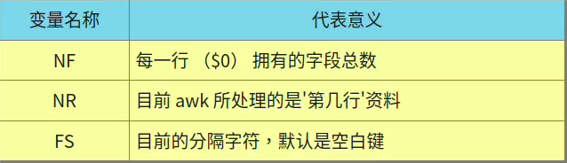
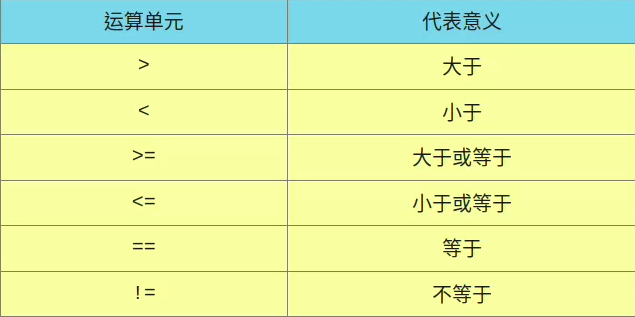

## 格式化打印： printf
```
[dmtsai@study ~]$ printf '打印格式' 实际内容
选项与参数：
关于格式方面的几个特殊样式：
       \a    警告声音输出
       \b    倒退键（backspace）
       \f    清除屏幕 （form feed）
       \n    输出新的一行
       \r    亦即 Enter 按键
       \t    水平的 [tab] 按键
       \v    垂直的 [tab] 按键
       \xNN  NN 为两位数的数字，可以转换数字成为字符。
关于 C 程序语言内，常见的变量格式
       %ns   那个 n 是数字， s 代表 string ，亦即多少个字符；
       %ni   那个 n 是数字， i 代表 integer ，亦即多少整数码数；
       %N.nf 那个 n 与 N 都是数字， f 代表 floating （浮点），如果有小数码数，
             假设我共要十个位数，但小数点有两位，即为 %10.2f 啰！
```
```
#范例：使用tab分隔
[dmtsai@study ~]$ printf '%s\t %s\t %s\t %s\t %s\t \n' $(cat printf.txt)
Name     Chinese         English         Math    Average
DmTsai   80      60      92      77.33
VBird    75      55      80      70.00
Ken      60      90      70      73.33
```
```
#范例：使用字符长度分隔
[dmtsai@study ~]$ printf '%10s %5i %5i %5i %8.2f \n' $(cat printf.txt | grep -v Name)
    DmTsai    80    60    92    77.33
     VBird    75    55    80    70.00
       Ken    60    90    70    73.33
```
- %8.2f 的意思为
  - 全部的宽度仅有 8 个字符，整数部分占有 5 个字符，小数点本身 （.） 占一位，小数点下的位数则有两位
- printf还能输入ASCII的对应字符
```
[dmtsai@study ~]$ printf '\x45\n'
E
```
## awk
- awk 是'以行为一次处理的单位'， 而'以字段为最小的处理单位'
```
[dmtsai@study ~]$ awk '条件类型1{动作1} 条件类型2{动作2} ...' filename
```
```
[dmtsai@study ~]$ last -n 5 | awk '{print $1 "\t" $3}'
dmtsai  192.168.1.100
dmtsai  192.168.1.100
dmtsai  192.168.1.100
dmtsai  192.168.1.100
dmtsai  Fri
```
- 每一行的每个字段都是有变数名称的，就是 $1， $2... 等变量名称
- $0 代表『一整列资料』的意思
- ### awk 的处理流程
  - 1.读入第一行，并将第一行的资料填入 $0， $1， $2.... 等变量当中;
  - 2.依据 “条件类型” 的限制，判断是否需要进行后面的 “动作”;
  - 3.做完所有的动作与条件类型;
  - 4.若还有后续的'行'的数据，则重复上面 1~3 的步骤，直到所有的资料都读完为止
- 
- ### awk 的逻辑运算字符
  - 
       ```
       yxj@yxj-computer:/tmp$ cat pay.txt | \
       > awk 'NR==1{printf "%10s %10s %10s %10s %10s\n",$1,$2,$3,$4,"Total"}
       > NR>=2{total=$2+$3+$4
       > printf "%10s %10d %10d %10d %10.2f\n",$1,$2,$3,$4,total}'
       Name        1st        2nd        3th      Total
       VBird      23000      24000      25000   72000.00
       DMTsai      21000      20000      23000   64000.00
       Bird2      43000      42000      41000  126000.00
       ```
  - 读入第一行的时候，那些变量 $1， $2... 默认还是以空白键为分隔
  - 所以要加BEGIN
- awk 的指令间隔：所有 awk 的动作，亦即在 {} 内的动作，如果有需要多个指令辅助时，可利用分号『;』 间隔， 或者直接以 [Enter] 按键来隔开每个指令
- awk 当中，变量可以直接使用，不需加上 $ 符号
## 文件对比工具
- ### diff：以行为单位进行两个文件的对比
  - 通常是用在同一的文件（或软件）的新旧版本差异上
       ```
       [dmtsai@study ~]$ diff [-bBi] from-file to-file
       选项与参数：
       from-file ：一个文件名，作为原始比对文件的文件名；
       to-file   ：一个文件名，作为目的比对文件的文件名；
       注意，from-file 或 to-file 可以 - 取代，那个 - 代表“Standard input”之意。

       -b  ：忽略一行当中，仅有多个空白的差异（例如 "about me" 与 "about     me" 视为相同
       -B  ：忽略空白行的差异。
       -i  ：忽略大小写的不同。
       ```
       ```
       范例一：比对 passwd.old 与 passwd.new 的差异：
       [dmtsai@study testpw]$ diff passwd.old passwd.new
       4d3    <==左边第四行被删除 （d） 掉了，基准是右边的第三行
       < adm:x:3:4:adm:/var/adm:/sbin/nologin  <==这边列出左边（<）文件被删除的那一行内容
       6c5    <==左边文件的第六行被取代 （c） 成右边文件的第五行
       < sync:x:5:0:sync:/sbin:/bin/sync  <==左边（<）文件第六行内容
       ---
       &gt; no six line                      <==右边（>）文件第五行内容
       ```
  - diff 也可以比对整个目录下的差异
       ```
       yxj@yxj-computer:/tmp/testpw$ diff /etc/rc0.d/ /etc/rc5.d/
       只在 /etc/rc0.d/ 存在：K01alsa-utils
       只在 /etc/rc0.d/ 存在：K01avahi-daemon
       ...后面省略...
       ```
- ### cmp:以字节对比
```
[dmtsai@study ~]$ cmp [-l] file1 file2
选项与参数：
-l  ：将所有的不同点的字节处都列出来。cmp 默认仅会输出第一个发现的不同点
```
```
#范例：cmp的使用
yxj@yxj-computer:/tmp/testpw$ cmp passwd.old passwd.new
passwd.old passwd.new 不同：第 120 字节，第 4 行
```
- ### pr；文件打印准备：pr