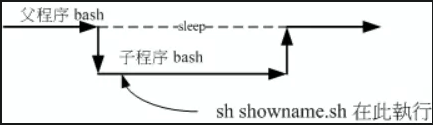
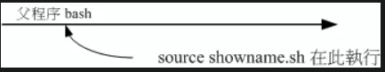

## Shell Script介绍
- ### shell script的优缺点
  - shell script 用在系统管理上面是很好的一项工具
  - 但Shell scripts 的速度较慢，且使用的 CPU 资源较多，造成主机资源的分配不良
- ### shell script的注意事项
  - 指令的执行是从上而下、从左而右的分析与执行;
  - 指令、选项与参数间的多个空白都会被忽略掉;
  - 空白行也将被忽略掉，并且 [tab] 按键所推开的空白同样视为空白键;
  - 如果读取到一个 Enter 符号 （CR） ，就尝试开始执行该行 （或该串） 命令;
  - 至于如果一行的内容太多，则可以使用『 \[Enter] 』来延伸至下一行;
  - 『 # 』可做为注解！ 任何加在 # 后面的数据将全部被视为注释文字而被忽略
- ### shell script的执行
  - 直接命令下达： shell.sh 文件必须具备可读和可执行（ rx） 的权限
    - 使用绝对路径与相对路径直接下达
  - 以 bash 程序来执行：通过' bash shell.sh '或' sh shell.sh '来执行
## 编写shell script的良好习惯
```
[dmtsai@study bin]$ vim hello.sh
#!/bin/bash
# Program:
#       This program shows "Hello World!" in your screen.
# History:
# 2015/07/16	VBird	First release
PATH=/bin:/sbin:/usr/bin:/usr/sbin:/usr/local/bin:/usr/local/sbin:~/bin
export PATH
echo -e "Hello World! \a \n"
exit 0
```
1. 第一行 #！/bin/bash 在宣告这个 script 使用的 shell 名称
   - 没有设定好这一行， 程序很可能会无法执行
2. 程序内容的说明:
   - 1.内容与功能; 2. 版本信息; 3. 作者与联络方式; 4. 建档日期; 5. 历史纪录 等等
3. 主要环境变量的宣告
4. 主要程序部分
5. 执行成果告知（定义回传值）
- 总结来说，文件头处记录：
  - script 的功能;
  - script 的版本信息;
  - script 的作者与联络方式;
  - script 的版权宣告方式;
  - script 的 History （历史纪录）;
  - script 内较特殊的指令，使用'绝对路径'的方式来下达;
  - script 运作时需要的环境变量预先宣告与设定
## script 的执行方式差异 （source， sh script， ./script）
- ### 利用直接执行的方式来执行 script
  - 利用直接执行的方式、bash（或sh）来执行 script，都会使用一个新的 bash 环境来执行脚本内的指令
  - script 其实是在子程序的 bash 内执行的
  - 
- ### 利用 source 来执行脚本：在父程序中执行
  - 